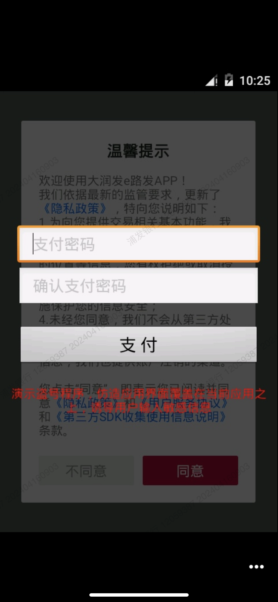

#### com.feiniu.b2b

Generally, com.feiniu.b2b is also referred to as the "RT-Mart e-Way service platform" or "RT-Mart e-Way manager". RT-Mart e-Way is an APP launched by RT-Mart to provide procurement services for small and medium-sized supermarkets, catering, entertainment, and enterprises and institutions. Activating a Trojan program can cover the target page with an interface overlay.

- package: com.feiniu.b2b
- version: 1.5.4
- url: https://os-android.liqucn.com/rj/1023242.shtml

poc:

