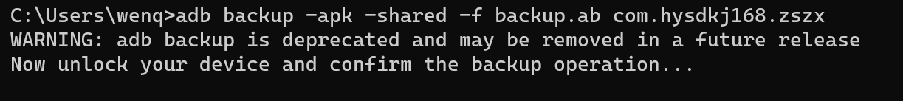

#### com.hysdkj168.zszx

com.hysdkj168.zszx has an Android manifest file that contains an entry with the android:allowBackup attribute set to true. This could be leveraged by an attacker with physical access to the device.

- package: com.hysdkj168.zszx
- version: 1.3.13
- url: https://os-android.liqucn.com/rj/172646.shtml

```xml
<application android:theme="@style/AppTheme.NoActionBar" android:label="@string/app_name" android:icon="@drawable/ic_launcher" android:name="MyWrapperProxyApplication" android:exported="false" android:allowBackup="true" android:hardwareAccelerated="true" android:supportsRtl="true" android:usesCleartextTraffic="true" android:networkSecurityConfig="@xml/network_security_config" android:appComponentFactory="android.app.AppComponentFactory" android:requestLegacyExternalStorage="true">
```

poc:

```shell
adb backup -apk -shared -f backup.ab com.hysdkj168.zszx
```

